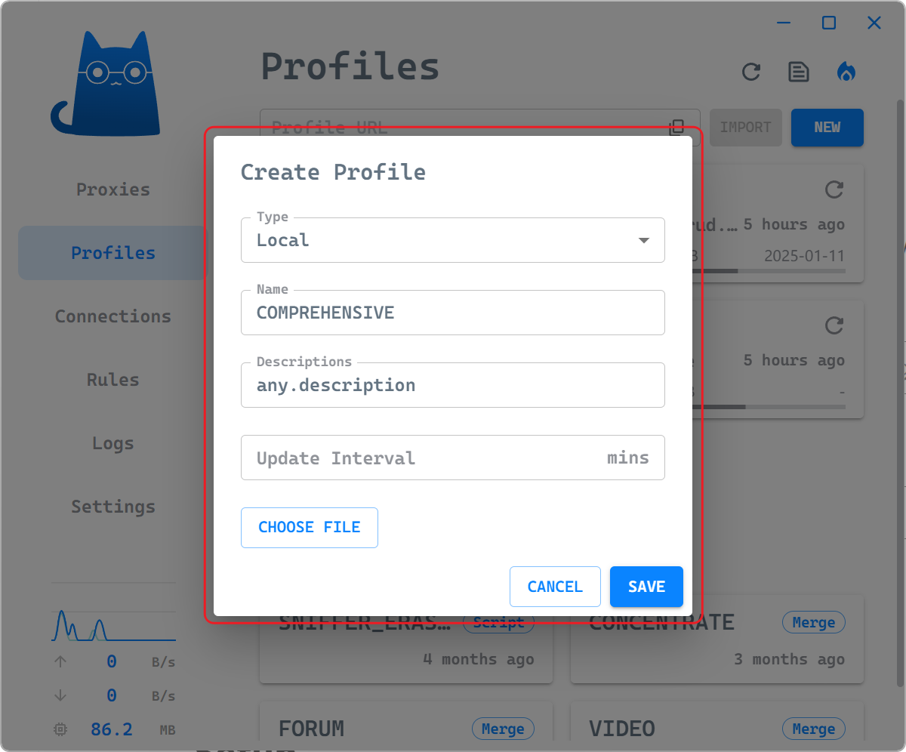
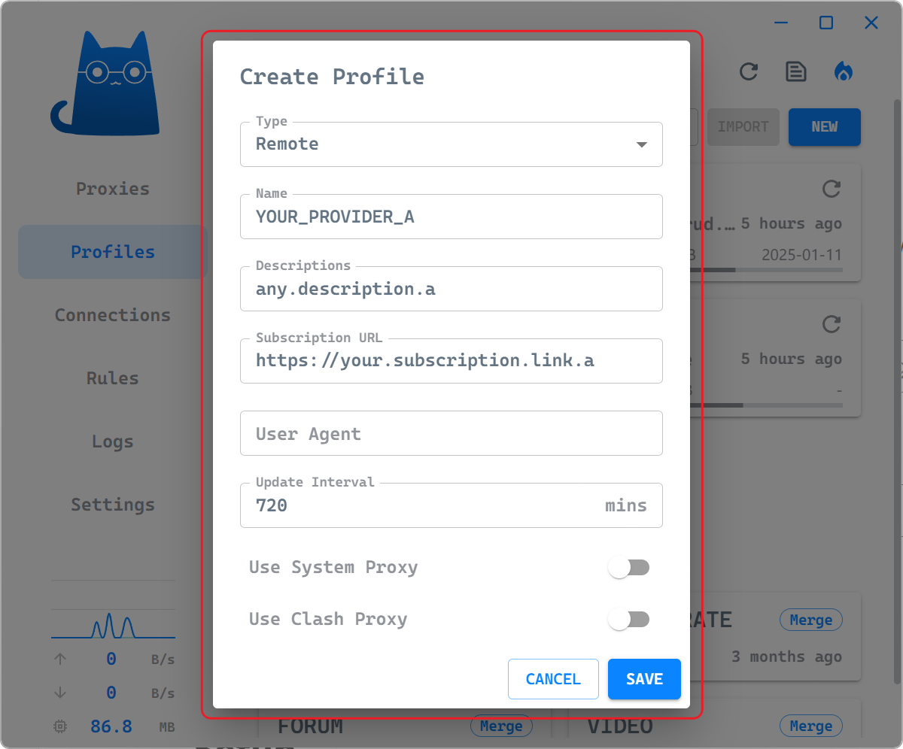
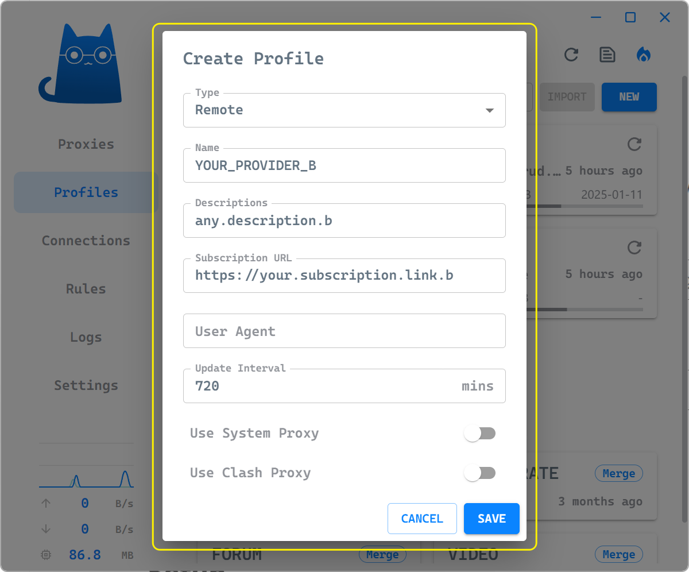
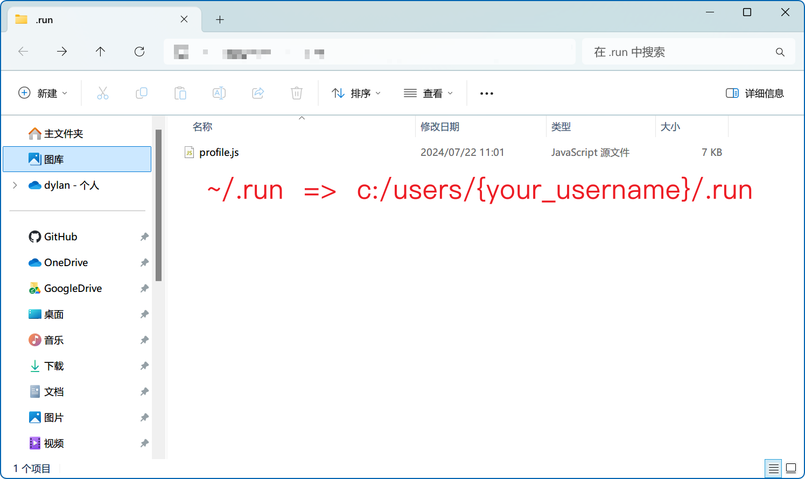
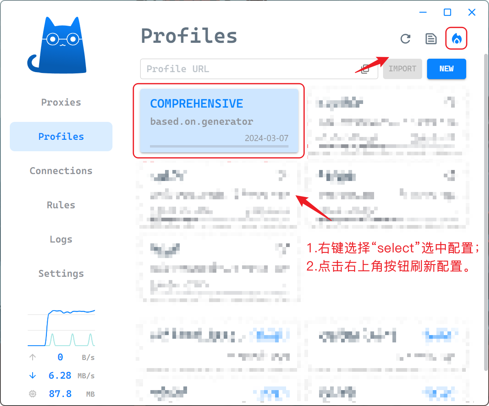

### Node.js

1. 项目依赖 [Node.js](https://nodejs.org/zh-cn) 运行时环境；

2. 拉取项目代码（**<u>不推荐下载 ZIP 压缩包，这可能导致 Windows Defender 出现误报</u>**）：

```bash
git clone https://github.com/dylan127c/agent-configs.git
```

3. 进入 `agent-configs` 目录安装项目所需模块：

```bash
npm install yaml, axios
```

### Clash Verge

1. 选择“Meta”内核（<u>**项目提供的默认规则所适配的内核为 Meta 版本内核**</u>）：

<div align="center"></div>

2. 关闭 Clash 字段过滤：

<div align="center"></div>

3. 建立空白本地配置：

<div align="center"></div>

4. 建立远程订阅配置：

<div align="center"></div>

<div align="center"></div>

### Setup && Run

1. 定位至 Clash Verge 配置目录 `~/.config/clash-verge/profiles` 找到所有的本地、远程配置所对应文件，例如：

|    CONFIG NAME    |      FILE NAME      |
| :---------------: | :-----------------: |
|  `COMPREHENSIVE`  | `mxdjj1rRmkl9.yaml` |
| `YOUR_PROVIDER_A` | `dwd39EFCcePi.yaml` |
| `YOUR_PROVIDER_B` | `Dcowdne9dcv2.yaml` |

2. 编辑 `agent-configs/generator` 目录下的 `profile.js` 文件，将上一步获取到的配置文件名填入配置文件中（<u>**注意，务必将无用的 `PROVIDER_X` 变量及其关联的内容移除**</u>）：

```yaml
...

const ALL_PROFILES_OUTPUT = "mxdjj1rRmkl9";

const PROVIDER_A = "P_A";
const PROVIDER_B = "P_B";

const PROXY_PROVIDERS_MAP = {
    [PROVIDER_A]: "dwd39EFCcePi",
    [PROVIDER_B]: "Dcowdne9dcv2",
};

...
```

3. 将编辑完毕的 `profile.js` 文件另存至 `~/.run` 目录中：

<div align="center"></div>

4. 回到 `agent-configs` 目录启动终端执行配置生成命令：

```
node -e "require('./run').run()"
```

<div align="center"></div>

5. 目录内将输出 `run.log` 文件：

```
[Jul,22][11:52:23] [ INFO] generate.generate => done.
[Jul,22][11:52:23] [ INFO] transform.transform => done.
[Jul,22][11:52:23] [ INFO] run.run => done.
[Jul,22][11:52:23] [ INFO] update.updateCheck => update suspended.
[Jul,22][11:52:23] [ INFO] update.updateCheck => last updated: 2024/07/22 00:02:26
```

6. 回到 Clash Verge 中更新 `COMPREHENSIVE` 配置：

<div align="center"></div>