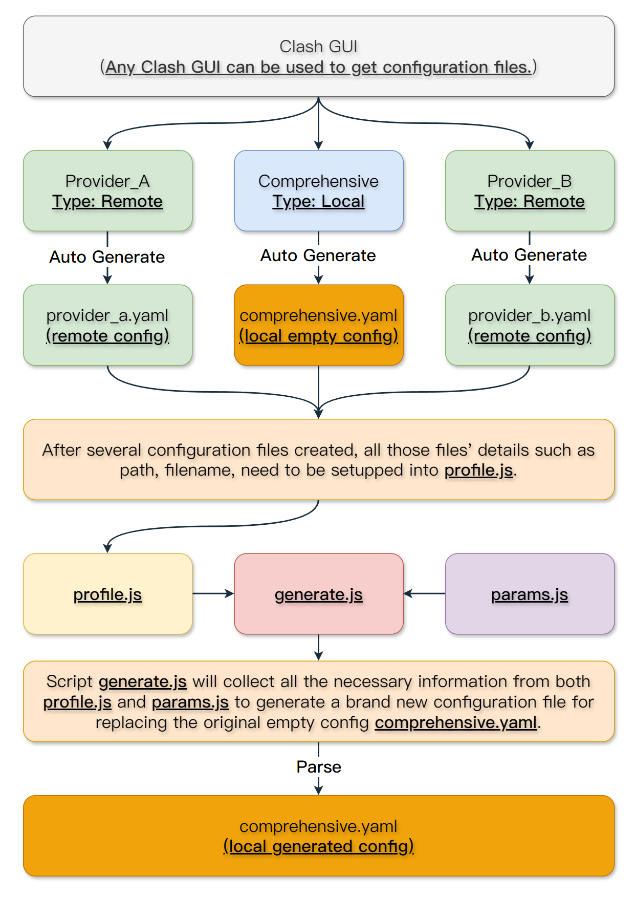
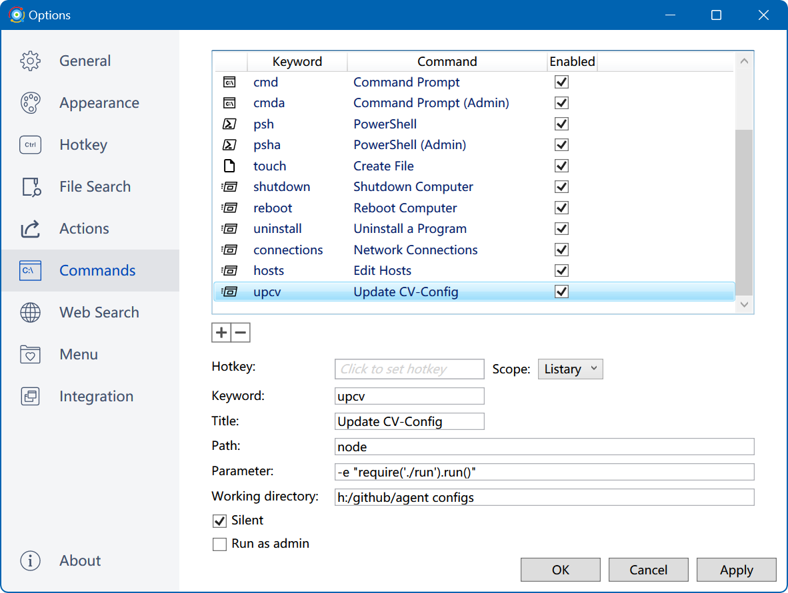

## AGENT CONFIGS

Quickly generating Clash configuration files. 

<div align="center"></div>

In fact, if you have the subscription configuration file which provided by the service provider already, then you can directly use those files to generate the new configuration file, at that time the Clash GUI could be useless.

Of course, by modifying few core code, you can even get that new configuration file by just providing the subscription link. But in any case, users generally choose to use the Clash GUI on Windows system, so it is more appropriate to leave the task of obtaining the service configuration file to Clash GUI.

### DEPENDENCE

Script requires the support of Node.js and these following modules:

```bash
npm install yaml
npm install axios
```

NOTE: Global installation (-g) is not recommended.

### CONFIGURATION

Those key configuration files are located in the `generator` directory.

#### profile.js

This file contains some user-customized configuration:

|        PARMAS         |                         DISCRIPTION                          |
| :-------------------: | :----------------------------------------------------------: |
| `PROXY_PROVIDER_PATH` |                location of all config files.                 |
| `PROXY_PROVIDER_TYPE` |                  file type of config file.                   |
| `PROXY_PROVIDERS_MAP` |    mapping between provider names and config file names.     |
| `ALL_PROFILES_OUTPUT` |                file name of generated config.                |
|   `PROVIDER_GROUPS`   | details of constructing specific proxy group for each provider.. |
|       `GROUPS`        |             details of user-defined proxy group.             |
|        `RULES`        |                details of distribution rules.                |

Note that the script requires the `profile.js` file to be placed under the `%homepath%/.run/` directory.

#### params.js

This file contains some basic configuration that doesn't change often, therefore it can be ignored.

### USAGE

After completing the configuration of the `profile.js` file, the following command can be used to generate the specific clash configuration:

```bash
node -e "require('./run').run()"
```

Command above will also checks whether the rule files need to be updated or not, meanwhile, converts these files into Loon supported rules files.

Note that the rule conversion always occurs regardless of whether the rule files need to be updated. Beside, all output logs are stored in log files with the same name as the script.

For more details: [HERE](./deploy.md).

### TIPS

Some File Search Tool support to run command line directly, such as Listary: 

<div align="center"></div>

By using them, there is no need to activate the terminal so frequently.

